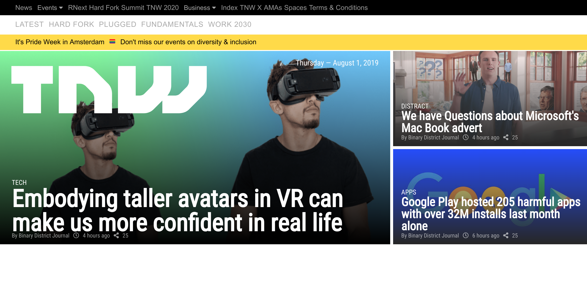
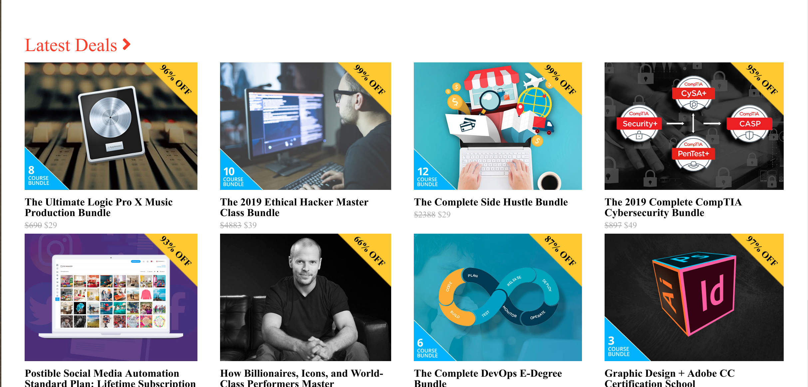
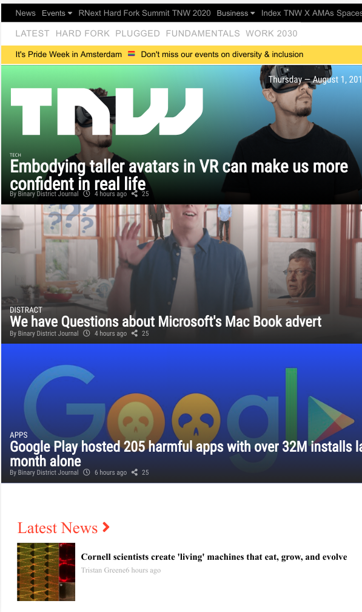
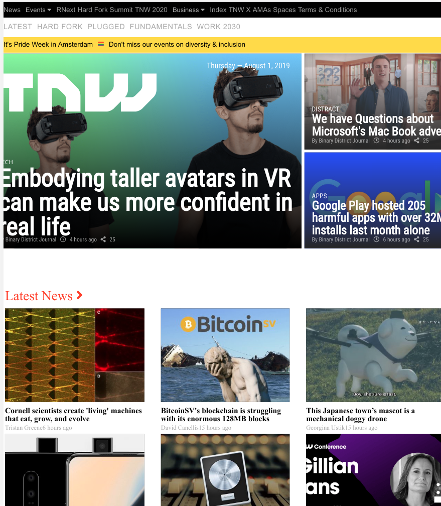

[Next-Web-Clone]
Responsive web design for the website https://thenextweb.com/

# Objectives
The objective of this assignment is to design a responsive website that can be accessible via different screen sizes.

# BreakPoints 
- Screen sizes about 1024px
- Screen sizes between 720p and 1024
- Screen sizes less than 720p

[live Preview](https://raw.githack.com/rmauritsson/Next-Web-Clone/media-queries/index.html)

[Screenshots]

